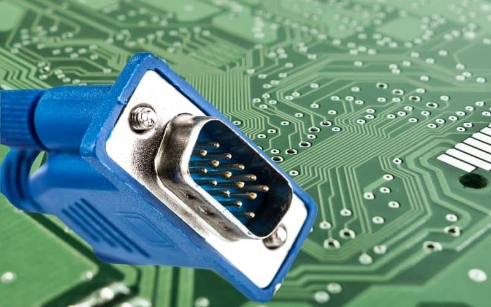

#+title: Chapstick
#+date: 2023-03-03
#+draft: false

From [[https://en.wikipedia.org/wiki/Disease_vector][Wikipedia]]:
#+begin_quote
 In epidemiology, a disease vector is any living agent that carries and transmits an infectious pathogen to another living organism; agents regarded as vectors are organisms, such as parasites or microbes.
#+end_quote

When I taught high school, the world were in a strange time. The year was 2005 (or 2006, I'd have to check linkedin), and the new-fangled idea in primary schooling was to go /paperless/. I will stub out a sentence here where I link to future writings on the banality of /going paperless/. But anyway, these were the days before sensible terminals of computing umbilical cords. Instead of the current crop of usb-whatever, where even infants can jam plugs into computer holes without much worry of damage, we as a culture decided the best way to connect two computing devices was to have a cable that ended in two dozen paperclip sized fountain pens and on our computing machines we'd have two dozen pen caps waiting. What's worse, back in those days, bits didn't just float through the air. These cables were often-times the only way to move what was on a student's screen onto a bigger shared screen.

#+ATTR_HTML: :width 700

So here I am, a high school science teacher trying to actually engage students in the material and in each other's work, and the only way for a student to share their work with the rest of the class was with the now hated VGA cable. Suffice to say, actual fountain pens would have faired better than these cables. One student would come to the front of class, grab the projector's VGA cable, and proceed to attempt ungodly things to try and get that cable to mate with their machine. And of course all those little pins, well not all because that might have been ok... some of those pins would bend. And what's worse, those pins would make it into the kid's machine. If that didn't happen, we would have declared the cable derelict and ordered a replacement, but no... it worked! And in the economic climate of a Philadephia public school in the early aughts, no working VGA cable would be replaced.
